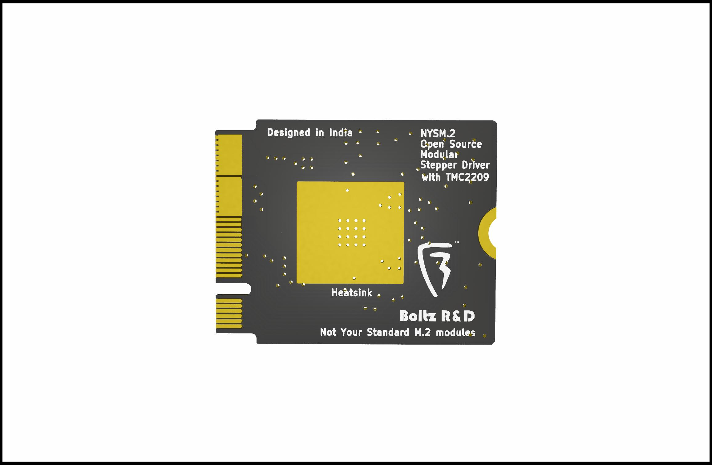
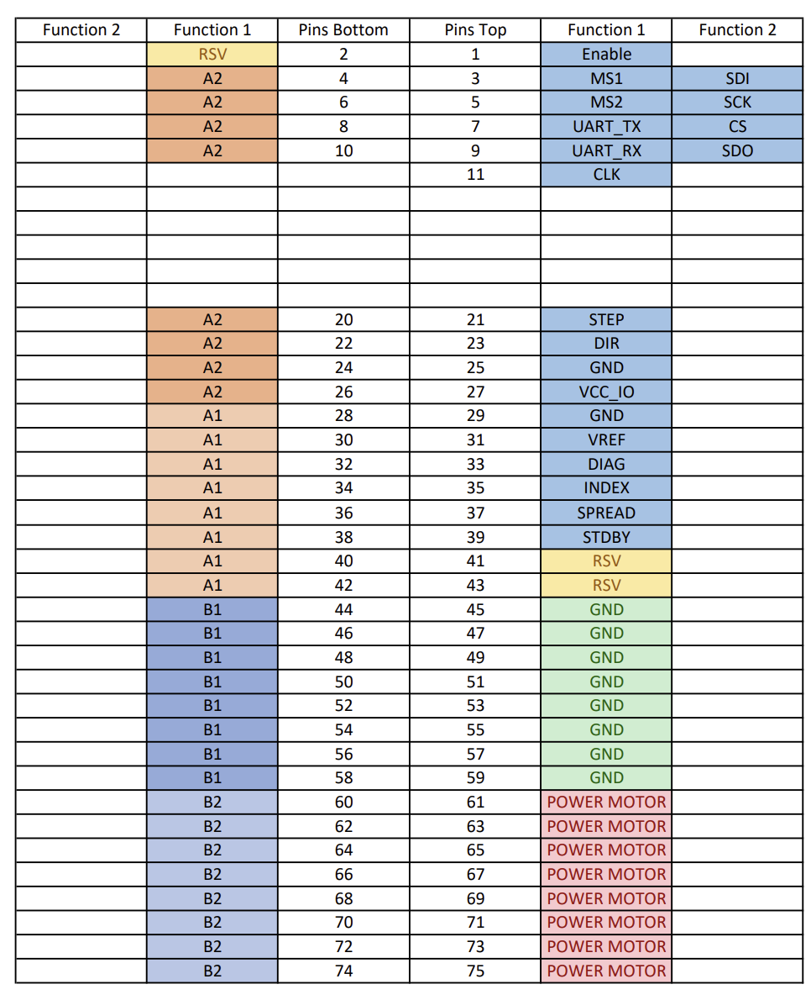

# NYSM.2 Open Stepper Standard
## Not Your Standard M.2
### "Not Your Standard M.2" is literally not your standard m.2 interface, and is a new open-source stepper motor driver board that utilizes the M.2 interface to control motors using the TMCxx and all other stepper drivers.

Modular stepper drivers are far superior than traditional pololu footprints as it has

1. Poka-yoke installations: The Key's in the interfaces makes sure that you never mess up installation orientations of the driver

apart from this NYSM.2 extends beyond these to provide more features as below:

1. physical locking mechanisms: to make sure drivers are locked in when In operation.

2. Horizontal installation: instead of vertical mounting, to not only save space in Z axis, but to also make the system less fragile to accidental damage if stuck by a physical shock.

3. Top and Bottom Installations: since NYSM.2 utilizes SMD and single layer mounted connectors, it means that it is possible to add by design 2 NYSM.2 modules in the same footprint area, drastically reducing the required footprint for more drivers - i.e - 20 drivers in 10 drivers area by installing 10 on top layer and 10 on bottom.

4. highly cost effective: since M.2 is a widely available standard with high MOQs already flooding the industry, the M.2 connectors can be integrated at very low costs into your design, where the stepper card doesn't even need a connector as it uses an edge connector built into the PCB only. in comparison to other modular standards that uses custom repurposed obsolete connector that has low manufacturing volumes. With NYSM.2 we can adopt a modular standard at almost same cost of a traditional pololu stepper drivers.

5. Powerful in terms of power: NYSM.2 utilizes 8 contacts(0.5A per pin) per power connection to deliver a whopping **4A** to the motors, that too at **24V**, that totals to **96W** per driver.
moreover it is theoretically possible to get more power out of it by increasing the voltages.

But that is not the best thing about NYSM.2 standard, the only best thing about it is only and only it's open source nature and GPL V3 license, that allows creators, hobbyist and manufacturers worldwide to move to a new and open modular stepper driver interface standard.
unlike other modular stepper interfaces, this interface is open inside out, and is not designed to lock you into single specific manufacturer's ecosystem. and is made for the world to use.

## The NYSM.2 Standard Pinout Format

## Pinout Table

| Pin Name   | Pin Number | Description                             
|------------|------------|-----------------------------------------|
| EN         | 1          | Enable/Disable Stepper Driver
| MS1        | 3          | Microstep Selection Pin 1 / CFG1 / SDI
| MS2        | 5          | Microstep Selection Pin 2 / CFG2 / SCK
| UART_TX    | 7          | UART Transmission (Communication) / CFG 3 / CS
| UART_RX    | 9          | UART Receive (Communication) / CFG0 / SDO
| CLK        | 11          | CLK input       
| STEP       | 21          | STEP input            
| DIR        | 23          | DIR input 
| GND        | 25          | Ground                   
| VCC_IO     | 27         | 3.3V to 5V IO supply voltage for all digital pins (does not supply IC logic part).
| GND        | 29         | Ground               
| VREF       | 31         | Analog reference voltage for current scaling or reference current for use of internal sense resistors
| DIAG       | 33         | Diagnostic and StallGuard output
| INDEX      | 35         | Configurable index output. Provides index pulse.
| SPREAD     | 37         | Chopper mode selection: Low=StealthChop, High=SpreadCycle (may be left unconnected)
| STDBY      | 39         | STANDBY input  
| GND        | 45, 47, 49, 51, 53, 55, 57, 59 | Ground/PSU Negative (0.5A per pin, 4A Total)
| POW_MOT    | 61, 63, 65, 67, 69, 71, 73, 75 | Motor supply voltage (0.5A per pin, 4A Total)
| A2         | 4, 6, 8, 10, 20, 22, 24, 26 | Motor coil A output 2 (0.5A per pin, 4A Total)
| A1         | 28, 30, 32, 34, 36, 38, 40, 42 | Motor coil A output 1 (0.5A per pin, 4A Total)
| B1         | 44, 46, 48, 50, 52, 54, 56, 58 | Motor coil B output 1 (0.5A per pin, 4A Total)
| B2         | 60, 62, 64, 66, 68, 70, 72, 74 | Motor coil B output 2 (0.5A per pin, 4A Total)

# License
NYSM.2 standard pinout and NYSM.2 TMC2209 Board contributed by Boltz R&D is licensed under GPL V3 license, and is owned by the community and everyone.
Also while the standard is open(i.e - The standard pinout sequence on M.2 Key B and it's derivatives only, that means proprietary manufacturers needs to be compliant to GPLV3 for only the pinout.),
you can integrate it into your proprietary designs as long as the NYSM.2 section of your design respects the license.
We invite all creators, hobbyist, and manufacturers to utilize the standard and the design.

# Key Features for this NYSM.2 TMC2209 Board:
* NYSM.2 Interface: Compact, modular design that fits into M.2 slots, making it easy to install and maintain.
* TMC2209 Stepper Driver: One of the Industry-leading drivers for stepper motors, featuring sensorless homing, stall detection, and ultra-quiet operation.

## Assembly and Setup

1. **Step 1**: Insert the **NYSM.2** board into an M.2 slot.
2. **Step 2**: Connect your stepper motor wires to the appropriate output terminals.
3. **Step 3**: Configure your firmware (e.g., **Marlin** or **Klipper**) to control the TMC2209 driver.
4. **Step 4**: Power on the system, and your motors are ready.

## Getting Started on Development:

Clone the repository:  
`git clone https://github.com/BoltzRnD/NYSM2_Open_Stepper_Standard`

# Join the Community
We are actively looking for contributors to help us enhance this project. You can join our community to discuss ideas, report bugs, or request features:

- **Discord**: [Join us here](https://discord.gg/xWGaHd83Hs)
- **Email**: info@boltzrnd.com

# Future Plans
- **Custom Heatsink Designs**.
- **Extended Compatibility**: support for other stepper driver like TMC5160 and TMC2130.

# Disclaimer
The **NYSM.2 standard and NYSM.2 board** is provided as-is without any warranties. Boltz R&D is not responsible for any damages or issues that may arise from the use of this board.

    NYSM.2 standard
    Copyright (C) 2024 Boltz R&D

    This Project/Open Standard is free: you can redistribute it and/or modify
    it under the terms of the GNU General Public License as published by
    the Free Software Foundation, either version 3 of the License, or
    (at your option) any later version.

    This is distributed in the hope that it will be useful,
    but WITHOUT ANY WARRANTY; without even the implied warranty of
    MERCHANTABILITY or FITNESS FOR A PARTICULAR PURPOSE.  See the
    GNU General Public License for more details.

    You should have received a copy of the GNU General Public License
    along with this program.  If not, see <https://www.gnu.org/licenses/>.

Contact : info@boltzrnd.com